<h1> Python & Full Stack Internship Training</h1>

<blockquote>
  
A collection of my internship tasks, Python practice programs, backend development, frontend projects, and healthcare applications built throughout my training.

</blockquote>

<h2> About This Repository</h2>

This repository documents my learning journey during my internship. It contains hands-on exercises, mini-projects, backend development, frontend applications, and real-world projects completed week by week.

Throughout this training, I explored:

<ul>
  <li>Python Programming</li>
  <li> Object-Oriented Programming (OOP)</li>
  <li>FastAPI Backend Development</li>
  <li>SQL Database Integration</li>
  <li>Server-Sent Events (SSE)</li>
  <li> WebSockets</li>
  <li>React.js</li>
  <li> Vite</li>
  <li> Tailwind CSS</li>
  <li>TypeScript</li>
</ul>

The repository demonstrates my progression from learning Python fundamentals to developing full-stack applications.

<h2>📂 Repository Structure</h2>

<pre><code>.
├── week1/
├── week2/
├── week3/
├── week4/
├── helthcareApp/
└── helth_care_chatbot/
</code></pre>

<h2>📖 Weekly Learning Journey</h2>

<h3>✅ Week 1 – Python Fundamentals</h3>

<strong>🎯 Learning Objectives</strong>

<ul>
  <li>Python syntax</li>
  <li>User input & output</li>
  <li>Conditional statements</li>
  <li>Loops</li>
  <li>Functions</li>
  <li>Mini console applications</li>
</ul>

<strong>📅 Day 2</strong>

Worked on beginner Python programs including:

<ul>
  <li>Hello World</li>
  <li>User information input</li>
  <li>Linked List practice</li>
  <li>Number conversion exercises</li>
</ul>

<strong>📅 Day 3</strong>

Focused on decision-making programs:

<ul>
  <li>Grade Generator</li>
  <li>Number Classification</li>
  <li>Password Validation</li>
  <li>Encapsulation examples</li>
</ul>

<strong>📅 Day 4</strong>

Practiced loop-based programming by building:

<ul>
  <li>Multiplication Table</li>
  <li>Sum Calculator</li>
  <li>FizzBuzz</li>
  <li>Number Guessing Game</li>
</ul>

<strong>📅 Day 5</strong>

Built simple console applications:

<ul>
  <li>📒 Contact Book</li>
  <li>✅ To-Do List</li>
</ul>

Created a <code>main.py</code> file to execute and connect all Week 1 programs.

<h3>✅ Week 2 – Object-Oriented Programming (OOP)</h3>

<strong>🎯 Learning Objectives</strong>

<ul>
  <li>Classes & Objects</li>
  <li>Inheritance</li>
  <li>Encapsulation</li>
  <li>Abstraction</li>
  <li>Polymorphism</li>
</ul>

<strong>📅 Day 5</strong>

Developed a simple ATM/Banking application featuring:

<ul>
  <li>Deposit</li>
  <li>Withdraw</li>
  <li>Balance Check</li>
  <li>PIN Verification</li>
</ul>

<strong>📅 Day 6</strong>

Implemented Shape classes including:

<ul>
  <li>Rectangle</li>
  <li>Circle</li>
</ul>

Calculated their areas using object-oriented concepts.

<strong>📅 Day 7 & Day 8</strong>

Worked on project organization by creating:

<ul>
  <li>Modular Python applications</li>
  <li>Better folder structure</li>
  <li>Reusable code</li>
</ul>

<h3>✅ Week 3 – Backend Development with FastAPI</h3>

<strong>🎯 Learning Objectives</strong>

<ul>
  <li>REST API Development</li>
  <li>FastAPI & SQL Database</li>
  <li>Routing</li>
  <li>Database Migrations</li>
  <li>Backend Architecture</li>
</ul>

<strong>📅 Day 13 & Day 14</strong>

Developed backend applications using FastAPI. Topics covered:

<ul>
  <li>API Routing & Database Configuration</li>
  <li>Migration Setup & CRUD Structure</li>
  <li>Project Organization</li>
</ul>

The project includes:

<ul>
  <li>FastAPI Application & Routers</li>
  <li>Database Connection</li>
  <li>Migration Runner & Configuration Files</li>
</ul>

<strong>📅 Day 15</strong>

Implemented real-time communication features:

<ul>
  <li>🔄 Server-Sent Events (SSE)</li>
  <li>🌐 WebSockets</li>
  <li>💬 Chat Application</li>
  <li>🗄️ SQL Database Integration</li>
</ul>

<h3>✅ Week 4 – Frontend Development</h3>

<strong>🎯 Learning Objectives</strong>

<ul>
  <li>HTML, CSS, JavaScript</li>
  <li>React & Vite</li>
  <li>Tailwind CSS</li>
  <li>TypeScript</li>
</ul>

<strong>📅 Day 16 & Day 17</strong>

Created interactive webpages using:

<ul>
  <li>HTML & CSS</li>
  <li>JavaScript (DOM Manipulation & Event Handling)</li>
</ul>

<strong>📅 Day 18</strong>

Started learning modern frontend tooling using Vite and React.

<strong>📅 Day 19</strong>

Expanded React knowledge by working with Components, Props, State Management, and Conditional Rendering.

<strong>📅 Day 20</strong>

Built a complete frontend application using React, Vite, TypeScript, and Tailwind CSS.

<strong>📅 Day 21</strong>

Connect with React frontend to  Day-14 tasks backend using TanStack Query.

<strong>📅 Day 22</strong>

fullstack integration with live updates and CORS auth creating chatApp and live SSE chatBot

<strong>📅 Day 23</strong>

Learned the fundamentals of Docker, including containers, images, volumes, networks, and Dockerfiles. Containerized both the FastAPI backend and React frontend by creating Dockerfiles and configuring Docker Compose to run multiple services together. Resolved dependency and environment configuration issues, tested the application inside containers, and gained an understanding of how Docker ensures consistent development and deployment environments..

<strong>📅 Day 24</strong>

Configured a GitHub Actions CI pipeline to automate code validation and learned how CI/CD streamlines the build, test, and deployment process. Also explored Docker fundamentals, including containers, images, and Docker Compose.

  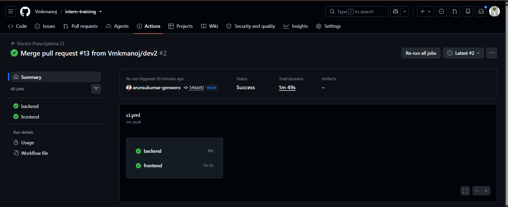
    

<h2>🏥 Major Projects</h2>

<h3>🤖 Healthcare Chatbot</h3>

Frontend healthcare application developed using React, TypeScript, and Modern UI Design.

<strong>Location:</strong> <code>helthcareApp/</code>

Backend chatbot application featuring Python, FastAPI, Redis, REST APIs, SQL Database, and Testing.

<strong>Location:</strong> <code>helth_care_chatbot/</code>

 

  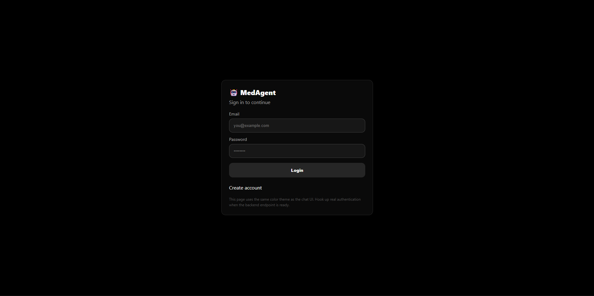
    
  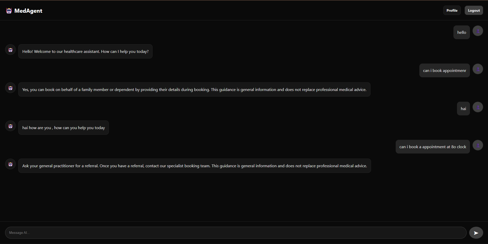
    
  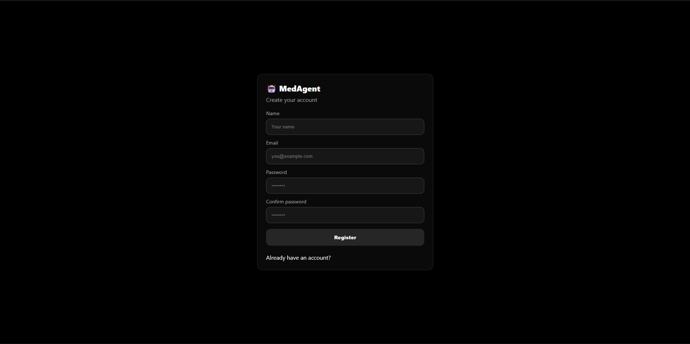
    
  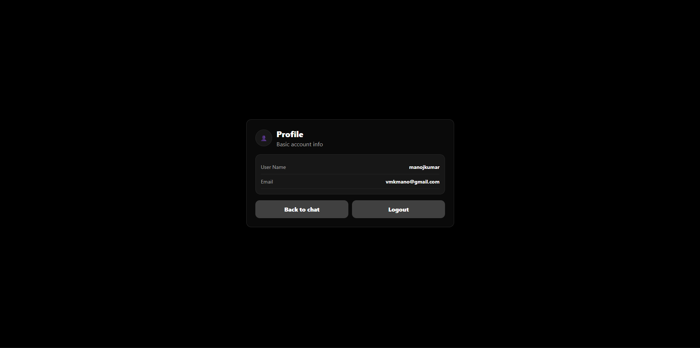

<h3>🤖 DoctorPrescription</h3>

Working on developing a hospital management system where receptionists can register patients, doctors can manage prescriptions, and the dashboard displays key statistics such as total doctors, total patients, and today's patients. I am building REST APIs using FastAPI, integrating the React frontend with TanStack Query, implementing JWT authentication, managing PostgreSQL with SQLAlchemy and Alembic, and setting up Docker and CI/CD for deployment.

<strong>Location:</strong> <code>DoctorPrescription/</code>

<ul>
  <li>Developing backend APIs using FastAPI and PostgreSQL.</li>
  <li>Implementing JWT authentication and role-based access.</li>
  <li>Building the React frontend with TanStack Query.</li>
  <li>Creating patient registration, doctor management, and dashboard modules.</li>
  <li>Managing database schema using SQLAlchemy and Alembic.</li>
  <li>Containerizing the application with Docker and configuring CI/CD for automated deployment.</li>
  <li>Fixing bugs, integrating APIs, and performing end-to-end testing.</li>
</ul>

 

  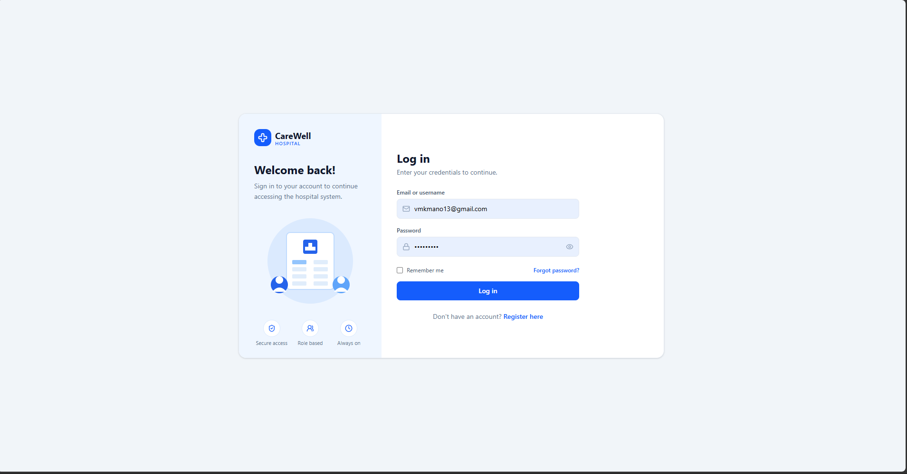
    
  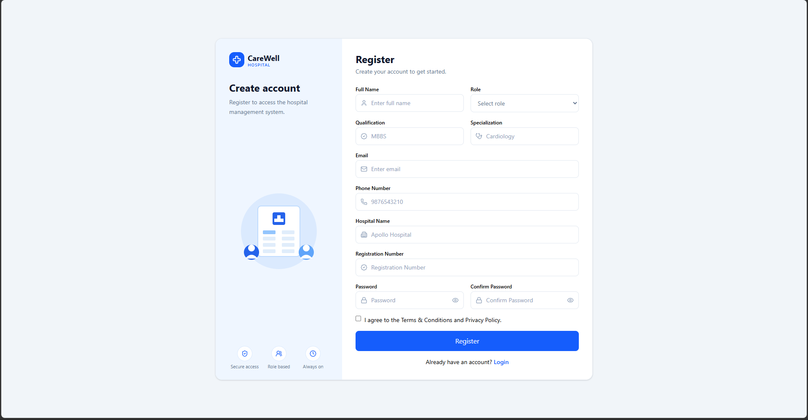
    
  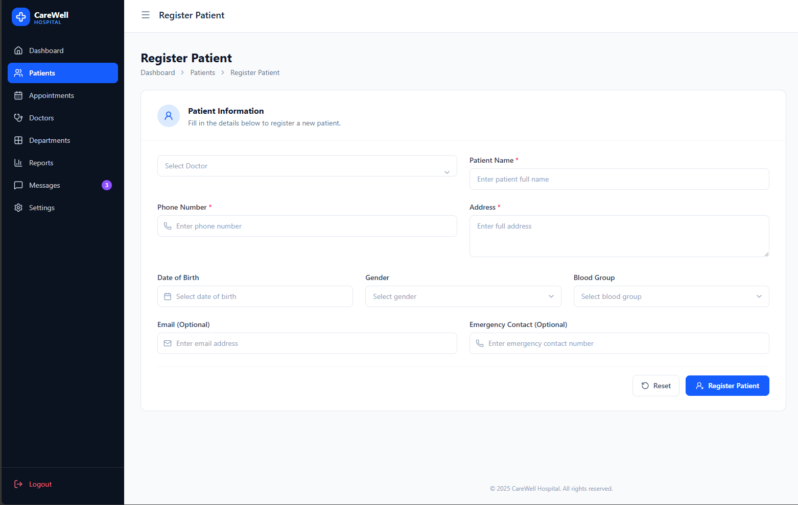
    
  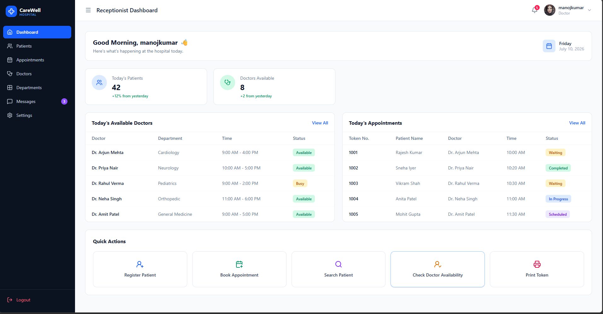

<h3>🤖 chatbox using webshocket</h3>

Worked on implementing a real-time chatbot using WebSocket to enable instant communication between the frontend and backend. Developed chat session management to create and maintain separate conversations for each user, and stored session history and chat messages in the database for future retrieval. Integrated the React frontend with the WebSocket APIs, implemented functionality to load previous conversations, optimized message handling, and performed end-to-end testing to ensure reliable real-time communication.

<strong>Location:</strong> <code>week_3/day15/</code>

<ul>
  <li>Developing backend APIs using FastAPI and PostgreSQL.</li>
  <li>Implementing JWT authentication and role-based access.</li>
  <li>Managing database schema using SQLAlchemy and Alembic.</li>
</ul>

 

  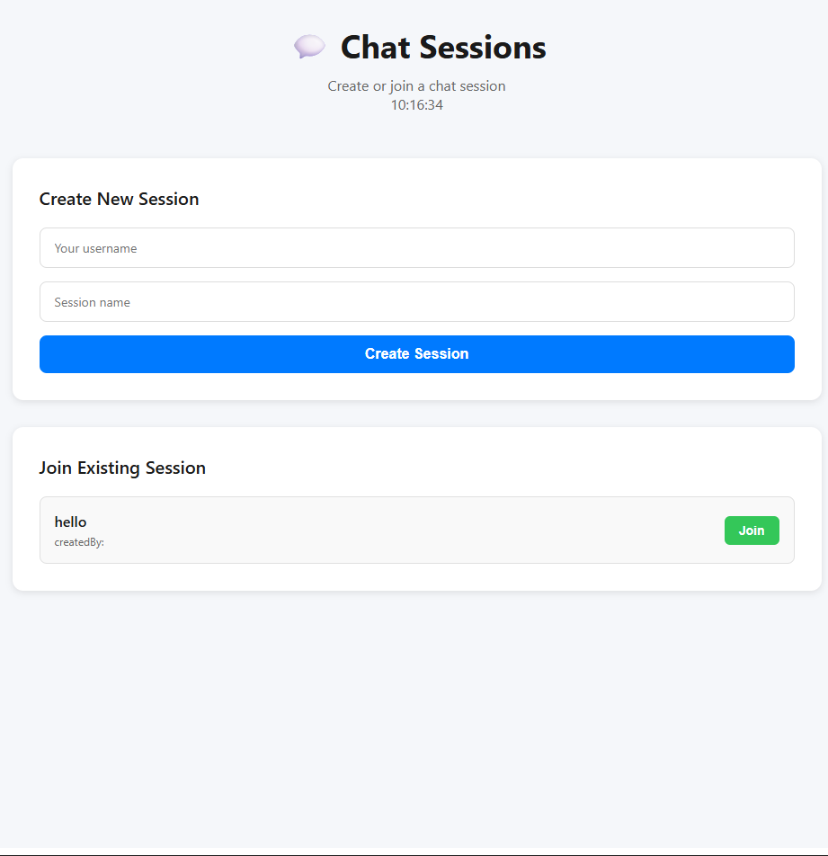
    
  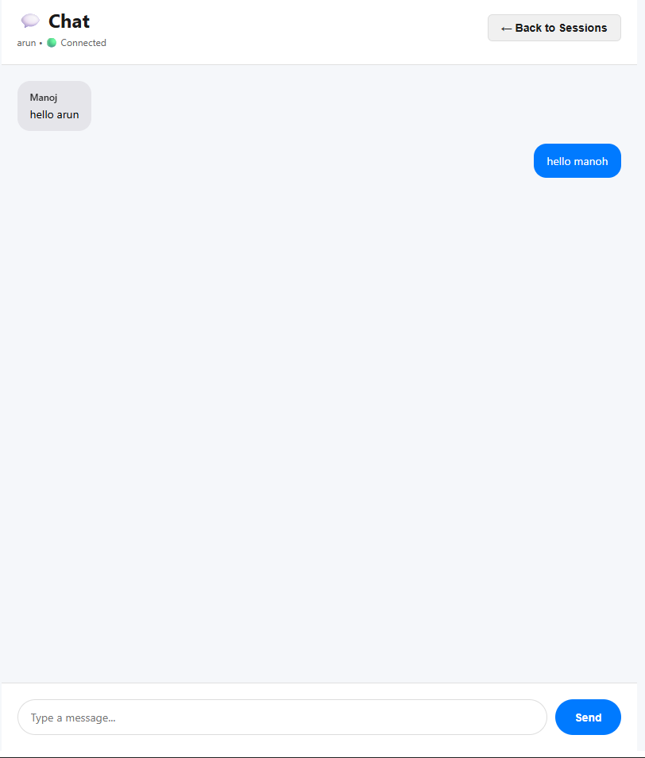
    
  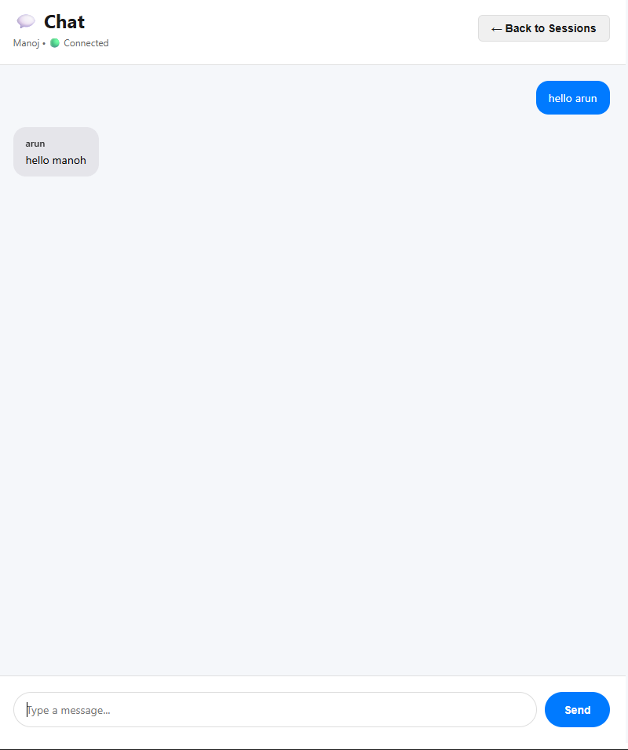

<h2>🛠️ Technologies Used</h2>

<strong>Languages:</strong> Python, JavaScript, TypeScript, HTML5, CSS5 
<strong>Frontend:</strong> React.js, Vite, Tailwind CSS 
<strong>Backend & Database:</strong> FastAPI, SQL 
<strong>Real-Time Communication:</strong> Server-Sent Events (SSE), WebSockets 
<strong>Tools:</strong> Git, GitHub, VS Code

<h2>▶️ Getting Started</h2>

<h3>Clone Repository</h3>
<pre><code>git clone https://github.com/Vmkmanoj/intern-training.git
cd intern-training
</code></pre>

<h3>Run Week 4 React Application</h3>
<pre><code>cd week4/day20/app
npm install
npm run dev
</code></pre>

<h3>Production Build</h3>
<pre><code>npm run build
npm run preview
</code></pre>

<h3>Run Python Backend</h3>
<pre><code>python -m venv .venv

# Windows
.venv\Scripts\activate

# Linux / macOS
source .venv/bin/activate

pip install -r requirements.txt
python main.py
</code></pre>

<h2>📈 Skills Gained</h2>

  ✔ Python & OOP 
  ✔ Data Structures 
  ✔ FastAPI & REST APIs 
  ✔ SQL Database 
  ✔ WebSockets & SSE 
  ✔ React, Vite & TypeScript 
  ✔ Tailwind CSS 
  ✔ Git, GitHub & Problem Solving

<h2>🎯 Future Improvements</h2>
<ul>
  <li>Add deployment guides</li>
  <li>Improve project documentation</li>
  <li>Write API documentation</li>
  <li>Add screenshots and demos</li>
  <li>Dockerize backend projects</li>
  <li>Implement CI/CD pipeline</li>
  <li>Increase automated test coverage</li>
</ul>

